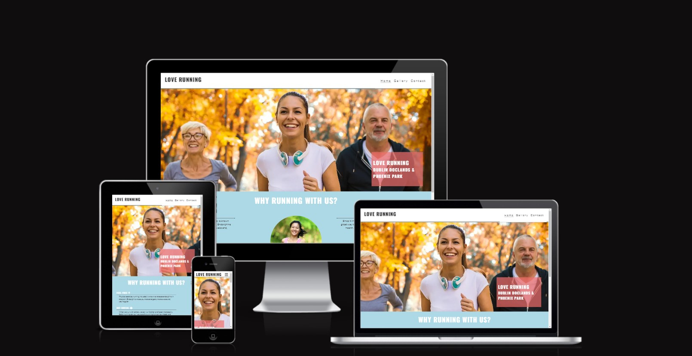

Welcome to the Love Running walkthrough project designed by Code Institute 
[Code-Institute-Solutions/love-running-v3](https://github.com/Code-Institute-Solutions/love-running-v3).
In this case study I build a project following CI lessons from start to finish, getting  used to github 
and consolidate some HTML and CSS skills.

Snippet from amiresponsive :
.

